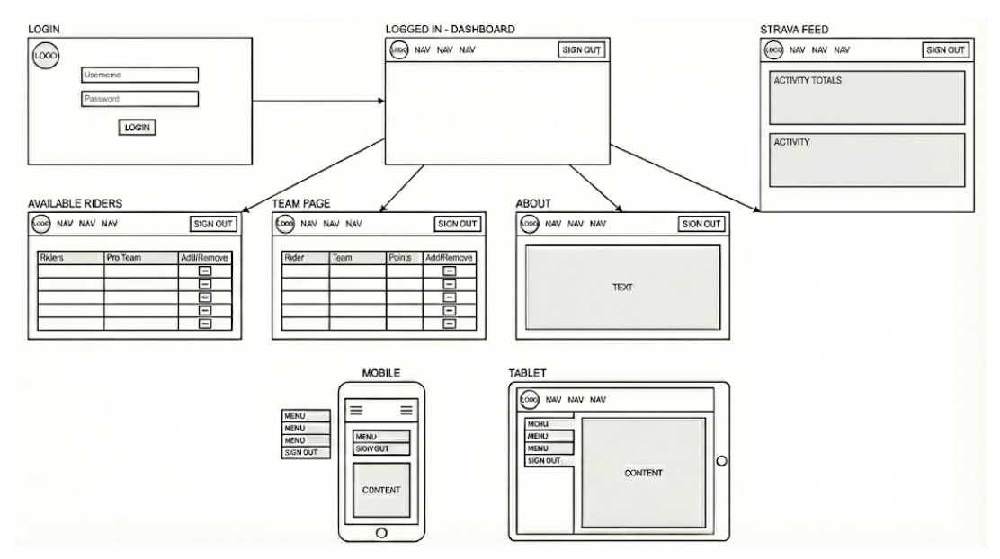
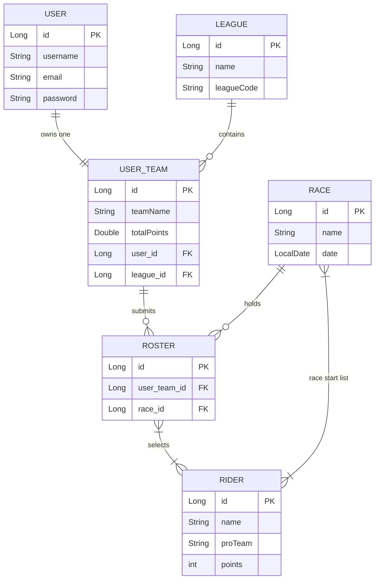

🚴‍♂️ FCL: Fantasy Cycling League

<table width="100%" cellspacing="0" cellpadding="0">
<tr>
<td height="8" bgcolor="#74B3CE" width="20%"></td>
<td height="8" bgcolor="#F28C8C" width="20%"></td>
<td height="8" bgcolor="#595959" width="20%"></td>
<td height="8" bgcolor="#F9D776" width="20%"></td>
<td height="8" bgcolor="#A2D176" width="20%"></td>
</tr>
</table>

📖 <b>Project Overview</b>

Fantasy Cycling League (FCL) is a full-stack web application designed to gamify professional cycling. Built to move beyond static data, FCL allows cycling fans to act as team managers by creating rosters of professional riders for real-world races. By integrating with the Strava API, the application bridges the gap between following the professional peloton and encouraging the user's personal fitness journey. Users can securely register, manage their squads dynamically, and track league standings in a responsive, modern interface.

🛠️ <b>Technologies Used</b>

Java, Spring Boot, Spring Data JPA, MySQL, JavaScript, React, Tailwind CSS

⚙️ <b>Installation & Setup</b>

Follow these steps to run the application locally on your machine.

1. Database Setup (MySQL)

        Create a new MySQL database for the application:
        
        CREATE DATABASE fcl_db;

2. Backend Setup (Spring Boot)

    A. Navigate to the backend directory: cd fcl-backend 

    B. Locate the src/main/resources/application.properties file and configure your environment variables:

        spring.datasource.url=jdbc:mysql://localhost:3306/fcl_db
        spring.datasource.username=YOUR_DB_USERNAME
        spring.datasource.password=YOUR_DB_PASSWORD
        spring.jpa.hibernate.ddl-auto=update

        # Strava API Credentials
        strava.client.id=YOUR_CLIENT_ID
        strava.client.secret=YOUR_CLIENT_SECRET

    C. Run the application using your IDE

3. Frontend Setup (React)

    A. Open a new terminal and navigate to the frontend directory: cd fcl-frontend

    B. Install the necessary dependencies:

        npm install

    C. Start the Vite development server:

        npm run dev
    
    D. Open http://localhost:5173 in your browser.

  

📐 <b>Planning & Architecture</b>

<em><b>Wireframes</b> - Visualizing the React component structure.</em>

    <h3></h3>
    

  
<em><b>Entity Relationship Diagram (ERD) </b>- 
Mapping the bidirectional JPA relationships (One-to-Many, Many-to-Many) between Users, Teams, and Riders.</em>

  

🚀 <b>Unsolved Problems & Future Features</b>

While the core MVP successfully handles CRUD operations and basic API fetching, software is never truly "finished." Here are the next steps for FCL:

<em>Automated OAuth 2.0 Handshake</em>: Currently, the Strava API integration requires a manual developer token exchange via terminal. The primary future feature is to build a dedicated Spring Boot redirect controller to handle the authorization_code grant type entirely behind the scenes, allowing users to connect their Strava with a single button click.

<em>Real-Time Race Scoring</em>: If an API can be found, implementing an automated scheduled task to ping external race result APIs and automatically update rider points based on their real-world performance. If one cannot be found, develop an algorithim to pass along the points from an ADMIN page.

<em>Refined Responsive Design</em>: Expanding on the current fluid typography to include fully collapsible mobile navigation menus and stacked data tables for smaller screens.